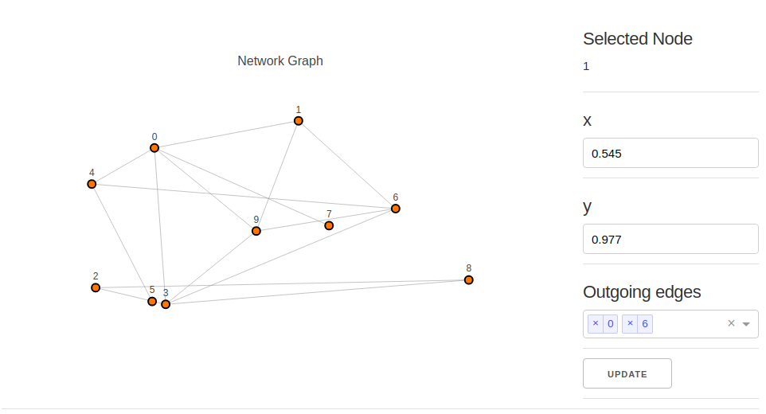

# graph_task

This simple Web App displays a random generated graph with 10 nodes.

If you click on a node the properties of that node are shown on the right.

The properties are position (x and y) and the outgoing edges.

You can modify the node's properties. When you click "Update" the graph will be updated.

